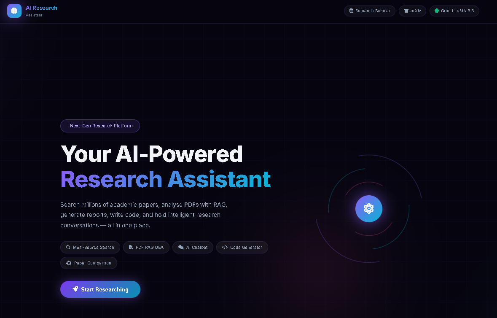
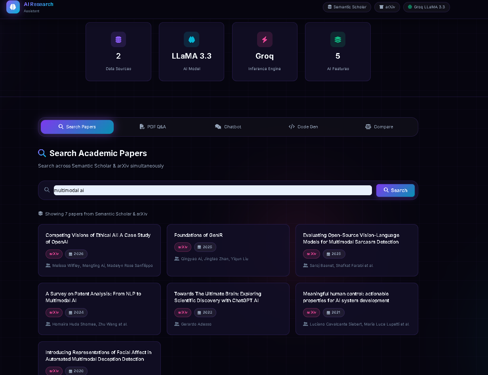

# AI Research Assistant

A production-ready AI-powered research assistant built with **Flask**, **Groq (LLaMA 3.3 70B)**, and a hybrid **RAG** pipeline (BM25 + ChromaDB + RRF). Search academic papers, analyse PDFs, generate code, and compare research — all through a clean web UI.

---


## Features

| Feature | Description |
|---|---|
| 🔍 **Paper Search** | Parallel search across Semantic Scholar + arXiv with relevance ranking |
| 📄 **PDF RAG Q&A** | Upload any PDF and ask questions using hybrid retrieval (BM25 + dense + RRF) |
| 📝 **Paper Reports** | Auto-generate 7-section academic reports for any paper |
| 💬 **Paper Q&A** | Ask questions about any search result using its abstract |
| 🧑‍💻 **Code Generator** | Multi-agent Developer → QA Reviewer → Lead Developer pipeline |
| 📊 **Paper Comparison** | Side-by-side comparison of two papers on any aspect |
| 🤖 **Multi-Paper Analysis** | Full 4-agent pipeline: Search → Reader → Compare → Planner |
| 📋 **PDF Summary** | One-click structured summary of any uploaded PDF |

---

## Project Structure

```
AI-Research_assistant-main/
├── app/                          # Flask application package
│   ├── __init__.py               # App factory (create_app)
│   ├── routes/
│   │   ├── __init__.py
│   │   └── api.py                # All page + REST API routes (Blueprint)
│   ├── services/
│   │   ├── __init__.py
│   │   ├── search.py             # Semantic Scholar + arXiv paper search
│   │   ├── rag.py                # PDF extraction + hybrid RAG Q&A
│   │   ├── report.py             # Paper & PDF report generation
│   │   ├── code_gen.py           # Multi-agent code generation
│   │   └── analysis.py          # Multi-paper analysis pipeline + paper Q&A
│   └── utils/
│       ├── __init__.py
│       └── text.py               # Pure string/text utility functions
├── core/                         # Infrastructure layer
│   ├── __init__.py
│   ├── config.py                 # Env loading, GROQ_API_KEY, feature flags
│   ├── llm.py                    # Groq client singleton + groq_chat() wrapper
│   └── agents.py                 # AutoGen agent definitions (no Docker)
├── scripts/
│   └── rag_test_lab.py           # Standalone RAG experimentation script
├── static/
│   ├── css/style.css             # Frontend styles
│   └── js/app.js                 # Frontend JavaScript
├── templates/
│   └── index.html                # Main UI template
├── extras/                       # Additional resources (untouched)
├── run.py                        # Application entry point
├── .env.example                  # Environment variable template
├── pyproject.toml                # Project metadata + dependencies (uv)
├── requirements.txt              # pip-compatible dependency list
└── README.md
```

---

## Setup

### 1. Clone the repository

```bash
git clone https://github.com/your-username/AI-Research_assistant.git
cd AI-Research_assistant
```

### 2. Create and activate a virtual environment

```bash
# Using uv (recommended)
uv venv
.venv\Scripts\activate      # Windows
source .venv/bin/activate   # macOS / Linux

# OR using pip
python -m venv .venv
.venv\Scripts\activate
```

### 3. Install dependencies

```bash
# Using uv
uv pip install -r requirements.txt

# OR using pip
pip install -r requirements.txt
```

### 4. Configure environment variables

```bash
cp .env.example .env
```

Edit `.env` and fill in your keys:

```env
GROQ_API_KEY=your_groq_api_key_here
FLASK_SECRET=your_random_secret_key_here
```

Get a free Groq API key at [console.groq.com](https://console.groq.com).

---

## Running the App

```bash
python run.py
```

The app starts at **http://localhost:5000**.

---

## API Reference

All endpoints accept and return JSON.

| Method | Endpoint | Description |
|--------|----------|-------------|
| `POST` | `/api/search` | Search papers. Body: `{"topic": "..."}` |
| `POST` | `/api/paper-report` | Generate paper report. Body: paper object |
| `POST` | `/api/paper-question` | Q&A on paper. Body: `{"paper": {...}, "question": "..."}` |
| `POST` | `/api/pdf-upload` | Upload PDF (multipart). Field: `pdf` |
| `POST` | `/api/pdf-question` | RAG Q&A on PDF. Body: `{"question": "..."}` |
| `POST` | `/api/pdf-summary` | Summarise uploaded PDF. No body needed |
| `POST` | `/api/generate-code` | Generate code. Body: `{"task": "...", "language": "python"}` |
| `POST` | `/api/compare-papers` | Compare two papers. Body: `{"paper1": {...}, "paper2": {...}, "aspect": "..."}` |
| `POST` | `/api/compare-top-papers` | Multi-paper analysis. Body: `{"topic": "...", "top_k": 3, "aspect": "..."}` |

---

## Optional Environment Flags

Control RAG behaviour via `.env`:

| Variable | Default | Description |
|---|---|---|
| `RAG_USE_HYBRID` | `true` | Enable hybrid BM25 + dense retrieval |
| `RAG_QUERY_REWRITE` | `true` | Rewrite queries with LLM before retrieval |
| `RAG_USE_RERANK` | `false` | Enable cross-encoder reranking step |
| `RAG_FINAL_TOP_K` | `4` | Number of chunks to pass to the LLM |
| `RAG_EMBEDDING_MODEL` | `sentence-transformers/all-MiniLM-L6-v2` | Embedding model for dense retrieval |
| `RAG_RERANK_MODEL` | `cross-encoder/ms-marco-MiniLM-L-6-v2` | Cross-encoder model for reranking |

---

## RAG Test Lab

The `scripts/rag_test_lab.py` script lets you experiment with retrieval quality independently from the web app:

```bash
python scripts/rag_test_lab.py
```

Edit the settings at the top of the file (`PDF_PATH`, `QUESTION`, `TOP_K_*`, etc.) to customise the run.

---

## Tech Stack

- **LLM** — Groq API (LLaMA 3.3 70B Versatile)
- **Agents** — AutoGen (no Docker)
- **Retrieval** — BM25 (`rank-bm25`) + ChromaDB + RRF fusion
- **Embeddings** — Sentence Transformers (`all-MiniLM-L6-v2`)
- **PDF Parsing** — PyPDF2
- **Text Splitting** — LangChain Text Splitters
- **Web Framework** — Flask 3
- **Package Manager** — uv / pip

---

## License

[MIT](LICENSE)
